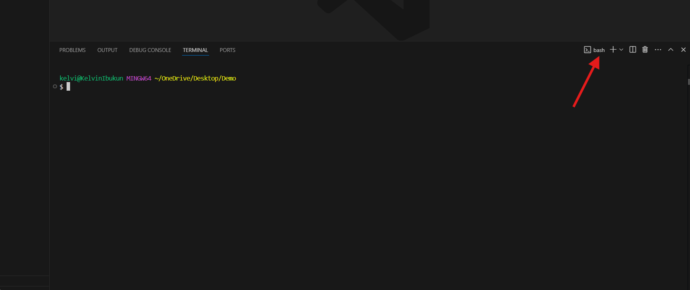
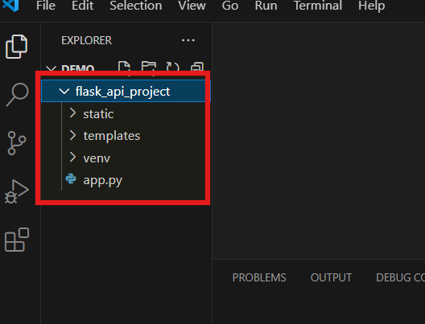
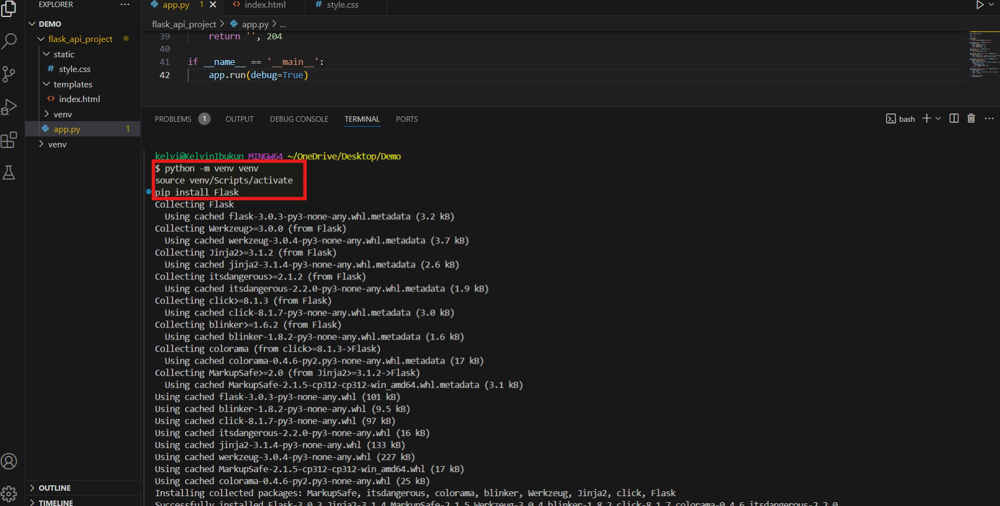
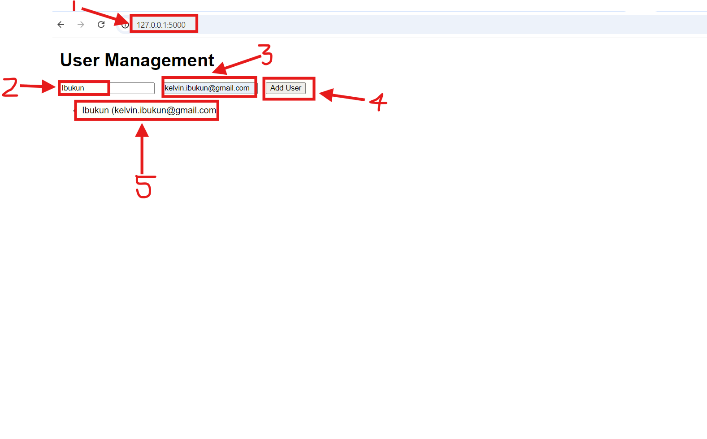
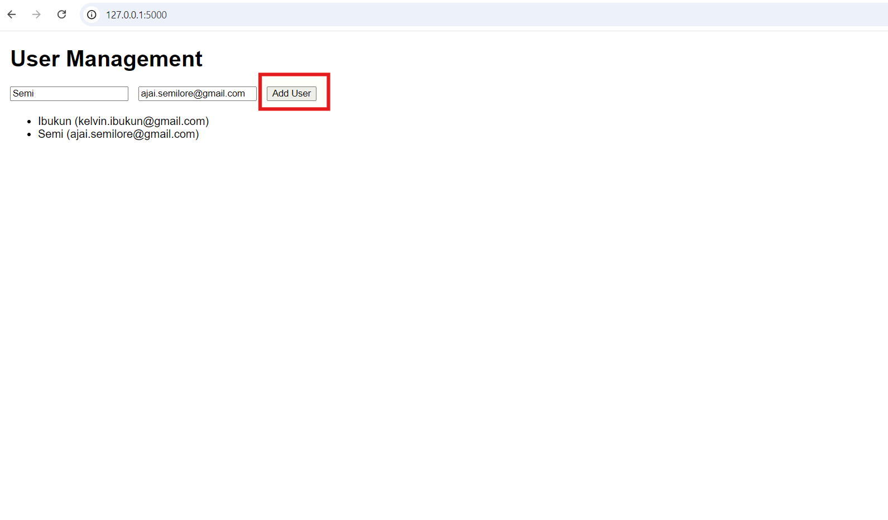
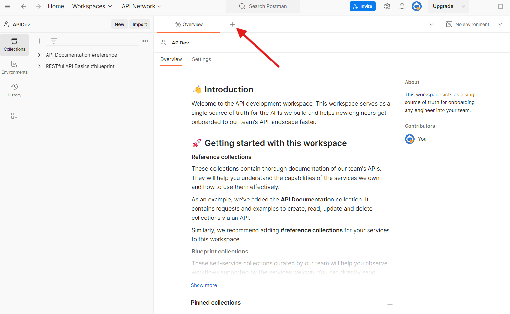
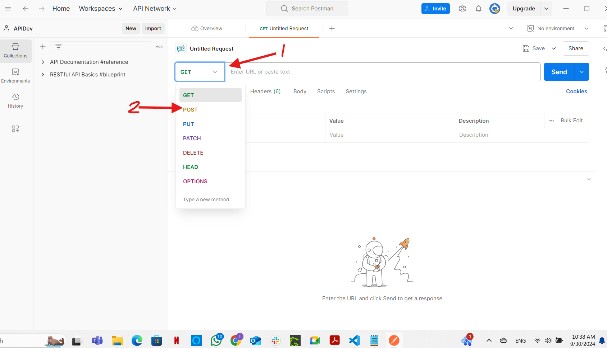
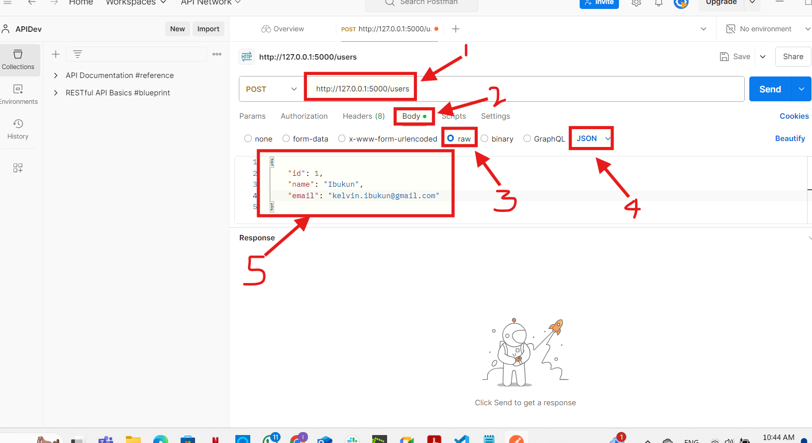
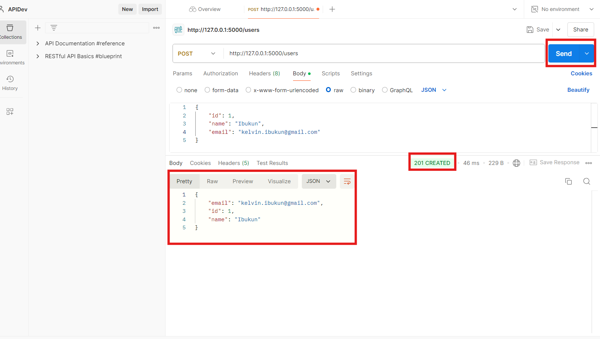

# Project 6: Setting up API using Flask

## API meaning:

An API (Application Programming Interface) lets different software talk to each other. It’s like a messenger that takes your request, tells the system what to do, and brings back the result.e.g. Payment and weather apps etc.

## Importance of APIs

**Modularity** - APIs let different parts of a software system work independently. For example, a mobile app can talk to a server without needing to know how it operates.

**Scalability** - APIs help systems grow easily by adding more servers or services without disrupting the current setup.

**Reusability** - APIs allow code and services to be reused across different apps, like a payment API being used by multiple e-commerce sites.

## Benefits of APIs

**Efficiency** - APIs automate tasks, reducing manual work.
**Innovation** - APIs make it easy for developers to integrate new technologies.
**Collaboration** - Teams can work on different parts of a system at once, improving productivity.

## Setting Up Project Directory

Using the knowledge from previous projects, I was able to set up VSCode using Gitbash.

Using the prompts below, I was able to create the project environment:

mkdir -p flask_api_project/{templates,static} && touch flask_api_project/app.py flask_api_project/templates/index.html flask_api_project/static/style.css && python -m venv flask_api_project/venv

I pasted the prompt below in the **app.py** file:

from flask import Flask, request, jsonify, render_template

app = Flask(__name__)

users = []

@app.route('/')
def home():
    return render_template('index.html')

@app.route('/users', methods=['POST'])
def create_user():
    user = request.get_json()
    users.append(user)
    return jsonify(user), 201

@app.route('/users', methods=['GET'])
def get_users():
    return jsonify(users), 200

@app.route('/users/<int:user_id>', methods=['GET'])
def get_user(user_id):
    user = next((u for u in users if u['id'] == user_id), None)
    return jsonify(user), 200 if user else 404

@app.route('/users/<int:user_id>', methods=['PUT'])
def update_user(user_id):
    user = request.get_json()
    index = next((i for i, u in enumerate(users) if u['id'] == user_id), None)
    if index is not None:
        users[index] = user
        return jsonify(user), 200
    return '', 404

@app.route('/users/<int:user_id>', methods=['DELETE'])
def delete_user(user_id):
    global users
    users = [u for u in users if u['id'] != user_id]
    return '', 204

if __name__ == '__main__':
    app.run(debug=True)

I pasted the prompt below in the **index.html** in the **templates** directory:

<!DOCTYPE html>
<html lang="en">
<head>
    <meta charset="UTF-8">
    <meta name="viewport" content="width=device-width, initial-scale=1.0">
    <title>API-Based Application</title>
    <link rel="stylesheet" href="{{ url_for('static', filename='style.css') }}">
</head>
<body>
    <h1>User Management</h1>
    <form id="userForm">
        <input type="text" id="name" placeholder="Name" required>
        <input type="email" id="email" placeholder="Email" required>
        <button type="submit">Add User</button>
    </form>
    <ul id="userList"></ul>

    
</body>
</html>

I pasted the prompt below in the **style.css** in the **static** directory

body {
    font-family: Arial, sans-serif;
    margin: 20px;
}

form {
    margin-bottom: 20px;
}

input {
    margin-right: 10px;
}

## Running the Application

I downloaded python and pasted the the prompt as shown below and then run the command flask run: 

To see the application, I opened my browser using http://127.0.0.1:5000 and followed the steps as shown in the 2 images below:

## Testing the API

**Using Postman**

Postman is a popular tool for building and testing APIs, making it easy to create, test, document, and share APIs with a simple, user-friendly interface.

I downloaded **Postman** and followed the steps as hown in the images below:

Go to the Body tab, select raw, and choose JSON from the dropdown.

I entered the code below in JSON data:

{
    "id": 1,
    "name": "your name",
    "email": "yourname@example.com"
}

I clicked on send and got the response below>

End of **PROJECT6**